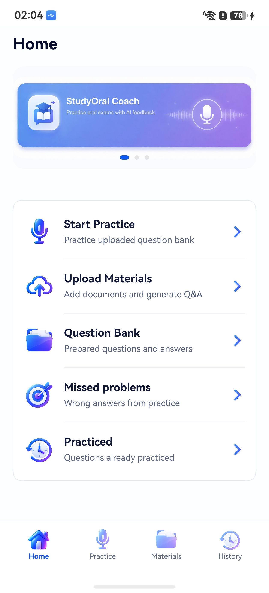
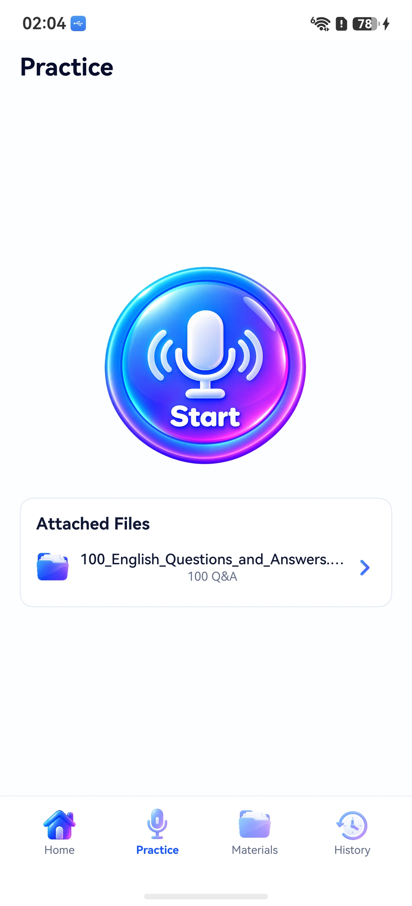
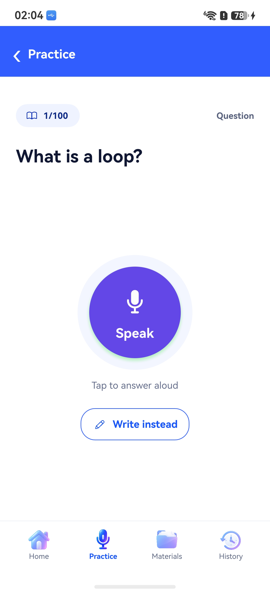
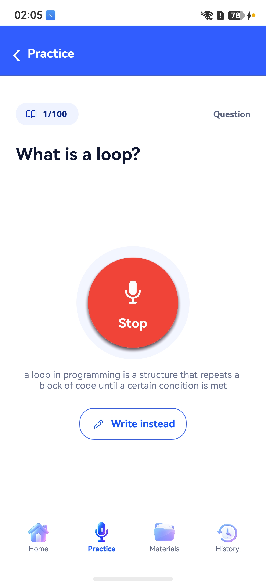
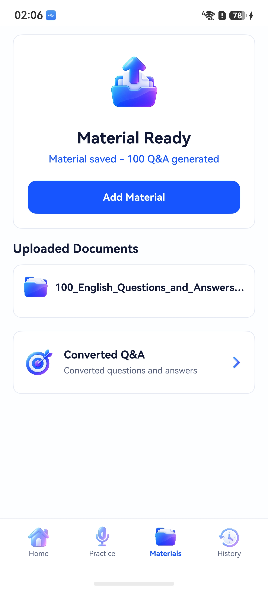
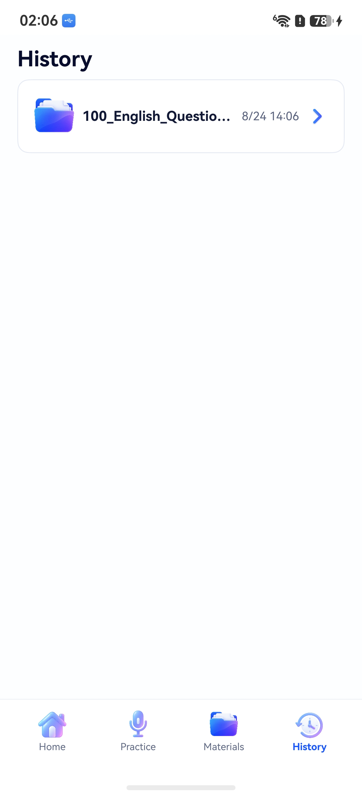
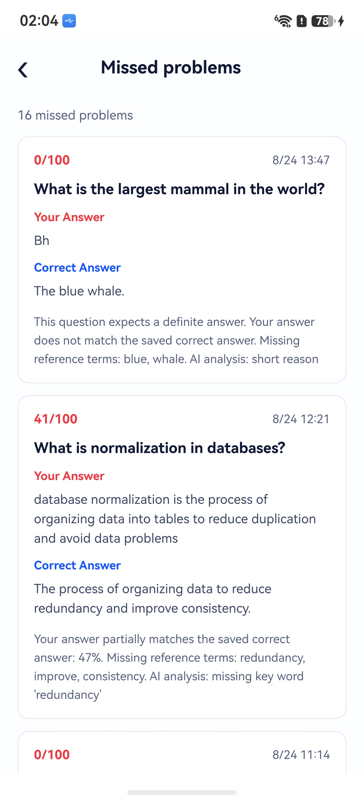
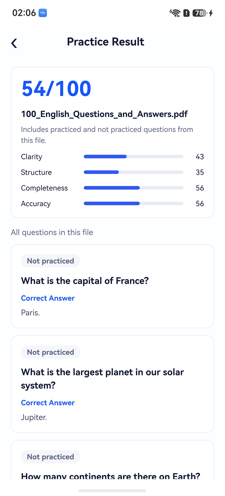

# StudyOral Coach

StudyOral Coach is a HarmonyOS / OpenHarmony study app for turning uploaded
question-and-answer documents into oral practice sessions. Users add study
materials, the app extracts Q&A pairs, then practice questions are randomly
served for spoken or typed answers with feedback against the saved answer.

## Screenshots

| Home | Practice | Speaking |
| --- | --- | --- |
|  |  |  |

| Recording | Materials | History |
| --- | --- | --- |
|  |  |  |

| Missed Problems | Practice Result |
| --- | --- |
|  |  |

## Core Idea

The app is built around uploaded pending related exam/interview material. A user uploads a PDF
or document that contains questions with answers directly below them. StudyOral
Coach extracts the text, identifies each question-answer pair, stores the data
locally, and uses that question bank for randomized practice.

The goal is not to generate generic questions from a topic. The app should
practice the exact material the user uploaded.

## Key Features

- Upload study material and keep a local copy for preview.
- Extract PDF text through a Docker backend powered by `pdfjs-dist`.
- Convert adjacent question-answer content into structured Q&A records.
- Store materials, extracted text, Q&A pairs, practice counts, and session
  history in the local SQLite database `study_oral_coach.db`.
- Practice by speaking or typing an answer.
- Stream microphone audio through the backend to Deepgram for speech-to-text.
- Score answers by comparing the user answer with the saved correct answer, with
  optional local AI feedback.
- Review all prepared questions, practiced questions, missed problems, and
  practice results by file.

## App Flow

1. Add a material from the Materials page.
2. The app copies the selected file into the app sandbox.
3. PDF content is sent to the backend extraction endpoint.
4. The backend uses `pdfjs-dist` to extract text and returns Q&A candidates.
5. The app stores the extracted text and Q&A pairs in SQLite.
6. Practice randomly selects questions from the uploaded question bank.
7. The user answers by voice or text.
8. The app evaluates the answer against the saved correct answer and records the
   result.

## Main Screens

- **Home**: quick entry points for practice, upload, question bank, missed
  problems, and practiced questions.
- **Practice**: start button, attached files, randomized question practice,
  voice input, typed input, scoring, and correct-answer feedback.
- **Materials**: add material, view uploaded documents, and inspect converted
  Q&A records.
- **History**: list practice sessions by file and time, then open the full
  practice result for that file.
- **Question Bank**: browse all prepared questions and their saved answers.
- **Missed Problems**: review incorrectly answered questions with user answers,
  correct answers, and feedback.

## Local Data

The app uses HarmonyOS ArkData `relationalStore` with the database name:

```text
study_oral_coach.db
```

Main tables:

- `study_materials`: uploaded file metadata, sandbox path, extracted text,
  preview text, extraction status, and question count.
- `material_questions`: converted question-answer pairs, source text, ordering,
  practice count, and last practiced time.

Practice-session records are stored by the app services and used to build the
History and result views.

## Backend

The backend is a small Node.js Docker service used for capabilities that are
better handled outside ArkTS:

- PDF extraction with `pdfjs-dist`.
- Local AI cleanup/evaluation through Ollama when enabled.
- Deepgram WebSocket proxy for speech-to-text.

Endpoints:

```text
GET  http://<host>:18081/health
POST http://<host>:18081/api/pdf/extract
POST http://<host>:18081/api/answer/evaluate
WS   ws://<host>:18081/listen
```

## Deployment

### Prerequisites

- DevEco Studio with the HarmonyOS / OpenHarmony SDK.
- `ohpm` dependencies installed for the app.
- Docker for the backend service.
- A Deepgram API key for voice transcription.
- Optional: Ollama running locally for Q&A cleanup and answer evaluation.

### Backend

Create `backend/.env` and set the private values locally:

```env
DEEPGRAM_API_KEY=your_deepgram_api_key
OLLAMA_URL=http://host.docker.internal:11434
OLLAMA_MODEL=llama3.2:3b
ENABLE_LOCAL_AI_QA=true
```

Then start the backend:

```bash
cd backend
docker compose up --build
```

For an emulator on the same computer, `127.0.0.1:18081` may work. For a real
phone, set `entry/src/main/ets/services/BackendConfig.ets` to the computer's LAN
IP address, for example:

```ts
export const STUDY_ORAL_PDF_BACKEND_BASE_URL: string = 'http://192.168.x.x:18081'
```

### App

Install dependencies and build:

```bash
ohpm install --all
oniro-app build
```

The project can also be opened and built directly in DevEco Studio.

## Technical Direction

StudyOral Coach keeps the mobile app focused on the practice experience and
local persistence. Heavy document processing and network speech recognition are
isolated in the Docker backend. This keeps the ArkTS client smaller while still
allowing reliable PDF parsing through `pdfjs-dist` and maintainable backend
logic for extraction and evaluation.

## Safety Boundary

StudyOral Coach is an educational practice tool. It does not verify that the
uploaded study material is correct, and its feedback should be treated as study
guidance rather than an authoritative grading result.

## Current Status

- PDF upload and extraction are implemented through the backend.
- Extracted Q&A pairs are stored locally in SQLite.
- Practice supports typed and spoken answers.
- Deepgram transcription is proxied by the backend.
- Materials, Question Bank, Missed Problems, and History screens are connected
  to local study data.
